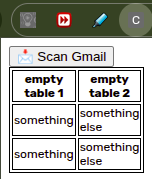

# CareerTrack – Development Notes

##  Day 1 – Project Setup

### What I Did
- Created project folder
- Initialized git repo
- Connected to GitHub using SSH
- Created .gitignore
- Created manifest.json

### What I Learned
- Chrome extensions require a `manifest.json` as the entry point
- GitHub no longer supports password authentication → must use SSH or tokens
- `.gitignore` hides sensitive/unnecessary files from commits

### Problems I Faced
- Git push failed due to authentication
- Didn’t understand SSH vs HTTPS

### How I Solved It
- Used `gh auth login`
- Switched remote to SSH

### Key Concepts
- SSH authentication
- Git remote origin
- Chrome Extension Manifest (v3)

---

##  Concepts to Revisit
- Chrome Identity API
- Gmail API structure
- OAuth flow

---

##  Ideas / Improvements
- Add job categorization (internship, full-time, etc.)
- Build dashboard UI later
- Add analytics (applications over time)

---

##  Questions I Still Have
- How does chrome.identity actually get Gmail access?
- What does the Gmail API response look like?

## Saving for later: 
        - ID: lehcmpidnijkanacnfbiilbbhgbljbea
        - Clied ID: 93530106094-7a2oih3sm8oqc6ej2pfo998guh1cjo9l.apps.googleusercontent.com

